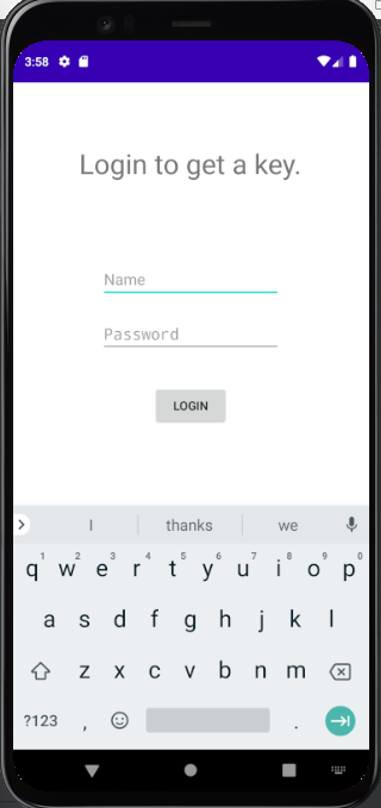
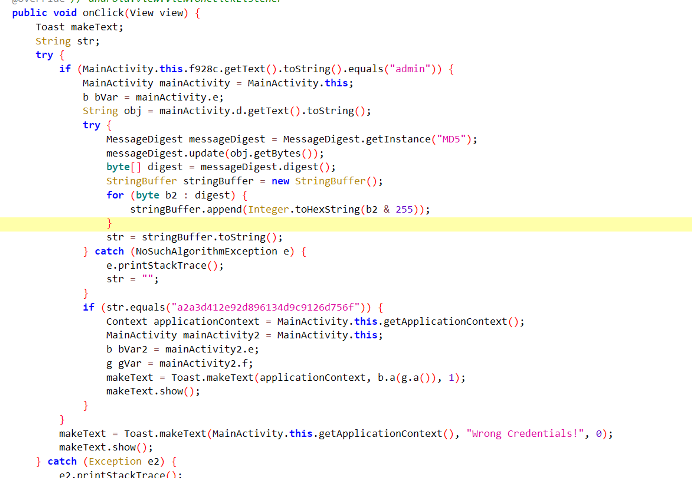
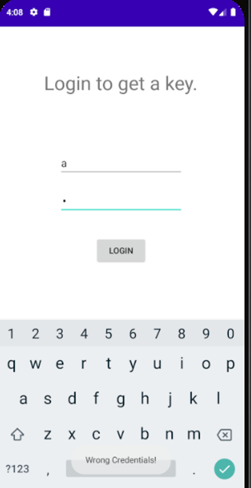
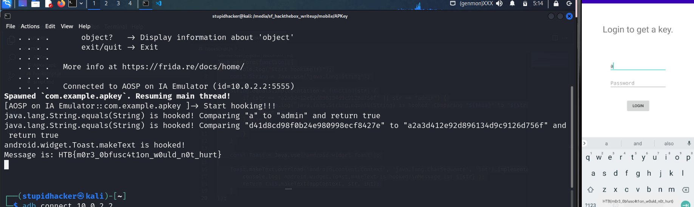

# Summary

Problem: **APKey**

Context of this challenge is that we have a login form, if it’s valid credential → a toast is shown with flag.

**Technique: Reverse Engineering + Hooking with Frida**

From RE, we can observe the workflow of this login form and hooking to this function to gain the flag



# Solution

## Reverse Engineering

Focusing on the function `onClick()` in class `com.example.apkey.MainActivity` 



Workflow:

- Checking that username is `admin` ?
- Hash the input of password field and compare to the hardcoded digested string
- If it is valid credential → showing a toast


## Hooking - Frida

Set up Frida client - server. Running Frida with hook script

In details, this script overloads 2 functions `java.lang.String.equals(String)` and `android.widget.Toast.makeText('android.content.Context', 'java.lang.CharSequence', 'int')` 

- Overload `String.equals()` to return true in checking form’s input
- Overload `Toast.makeText()` to gain the flag

```javascript
Java.perform(function(){
    console.log("Start hooking!!!");
    const String = Java.use('java.lang.String');

    String.equals.implementation = function(str) {
        if (str == "a2a3d412e92d896134d9c9126d756f" || str == "admin") {
            console.log(`java.lang.String.equals(String) is hooked! Comparing "${this}" to "${str}" and return true`);
            return true;
        } else {
            return this.equals(str);
        }
    }
    
    const Toast = Java.use('android.widget.Toast');

    Toast.makeText.overload('android.content.Context', 'java.lang.CharSequence', 'int').implementation = function(appContext, str, int) {
        console.log(`android.widget.Toast.makeText is hooked!\nMessage is: ${str}`);
        return this.makeText(appContext, str, int);
    }
});
```

Hooking result:



Flag: `HTB{m0r3_0bfusc4t1on_w0uld_n0t_hurt}`