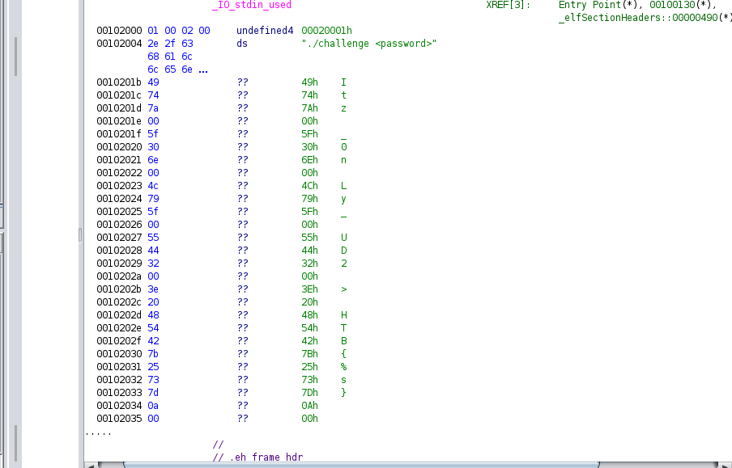

# Behind the Scenes
> [Behind the Scenes](https://app.hackthebox.com/challenges/behind-the-scenes)

## Solution
Try to run `behindthescences`:
```
$ ./behindthescenes   
./challenge <password>
```
So it requires a parameter when running.

Decompile `behindthescences` with `ghidra`. I see a potential string:

so I try password `Itz_0nLy_UD2` and it's the flag too:
```
$ ./behindthescenes 'Itz_0nLy_UD2'             
> HTB{Itz_0nLy_UD2}
```
