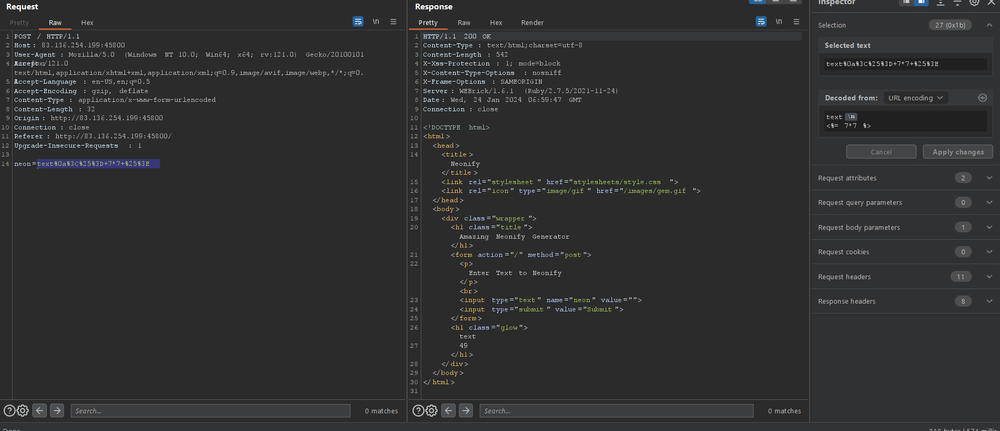
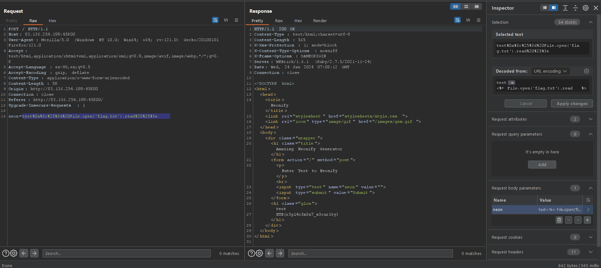

# Neonify
> Challenge: [Neonify](https://app.hackthebox.com/challenges/neonify)
> 
> Read:
> + [SSTI](https://book.hacktricks.xyz/pentesting-web/ssti-server-side-template-injection)
> + [Bypassing regular expression checks with a line feed](https://davidhamann.de/2022/05/14/bypassing-regular-expression-checks/)

## Summary
**Server-side template injection(SSTI) + Bypass regex + Ruby** 
> Identifying language Ruby and focusing on reflecting input to detect SSTI and exploit by bypassing regex.

## Solution
Typing in put and see it's reflected in the html, easily realizing that it can be used XSS or SSTI

Focus on `neon.rb`:
```ruby
class NeonControllers < Sinatra::Base

  configure do
    set :views, "app/views"
    set :public_dir, "public"
  end

  get '/' do
    @neon = "Glow With The Flow"
    erb :'index'
  end

  post '/' do
    if params[:neon] =~ /^[0-9a-z ]+$/i
      @neon = ERB.new(params[:neon]).result(binding)
    else
      @neon = "Malicious Input Detected"
    end
    erb :'index'
  end

end
```
It's more clearly that we should exploit SSTI but having to bypass `/^[0-9a-z ]+$/i`. Search for bypassing in Google, I found a [multi-line method](https://davidhamann.de/2022/05/14/bypassing-regular-expression-checks/)

Payload for SSTI detection of Ruby is `<%= 7*7 %>`, feed it into the input:

Now the regex is bypassed! Use SSTI to read `flag.txt` with payload `text\n<%= File.open('flag.txt').read %>`:

**Flag:**`HTB{r3pl4c3m3n7_s3cur1ty}`

