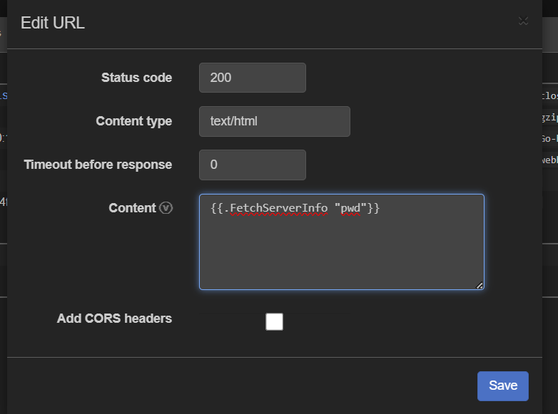
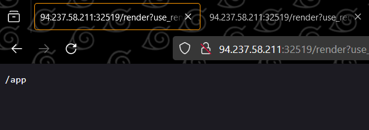
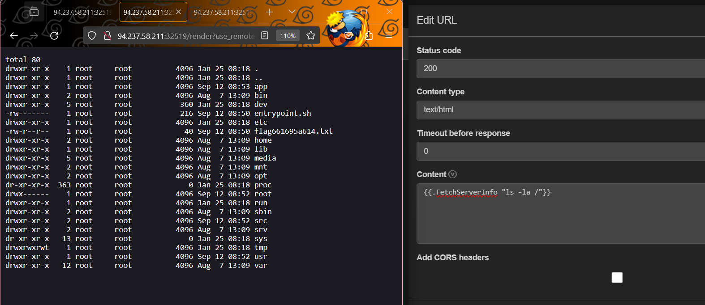
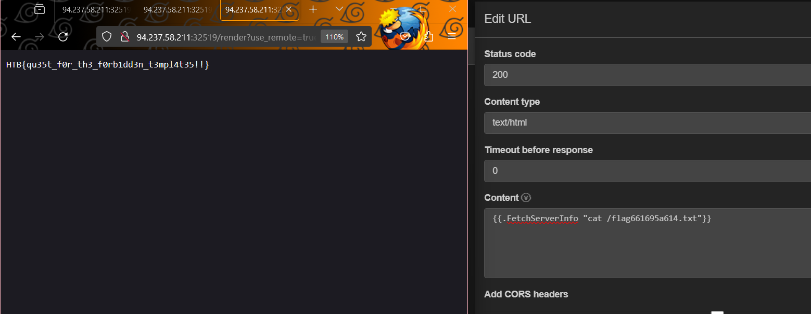

# RenderQuest
> Challenge: [RenderQuest](https://app.hackthebox.com/challenges/renderquest)
> 
> Read:
> + [SSTI in go](https://book.hacktricks.xyz/pentesting-web/ssti-server-side-template-injection#ssti-in-go)
> + [go SSTI method research](https://www.onsecurity.io/blog/go-ssti-method-research/)

## Summary
**SSTI in go + RCE**
> White-box testing with potential source code to exploit SSTI to do RCE

## Solution
Focus on these code:
```go
type RequestData struct {
	ClientIP     string
	ClientUA     string
	ServerInfo   MachineInfo
	ClientIpInfo LocationInfo `json:"location"`
}

func (p RequestData) FetchServerInfo(command string) string {
	out, err := exec.Command("sh", "-c", command).Output()
	if err != nil {
		return ""
	}
	return string(out)
}
```
We can see that it will execute any command we put into, so using a [web hook](https://webhook.site/) to create a full request data to put template payload into:

Read more to know about template syntax in go:
+ https://www.onsecurity.io/blog/go-ssti-method-research/
+ https://pkg.go.dev/text/template




**Flag:** `HTB{qu35t_f0r_th3_f0rb1dd3n_t3mpl4t35!!}`